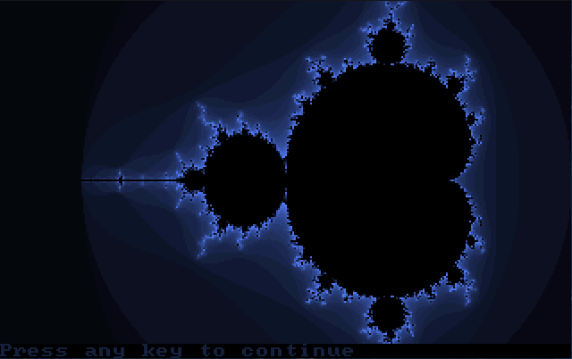

# QBasic Mandelbrot

QBasic code to render a Mandelbrot set.

## Running QBasic

1. Install DOSBox
2. Download in install [QBasic](https://www.qbasic.net/en/qbasic-downloads/compiler/qbasic-interpreter.htm)
3. Run `QBASIC MANDELBR.BAS` to render the fractal and generate a RAW file
4. Run `QBASIC SHOWRAW.BAS` to view the RAW file and animate the palettes
